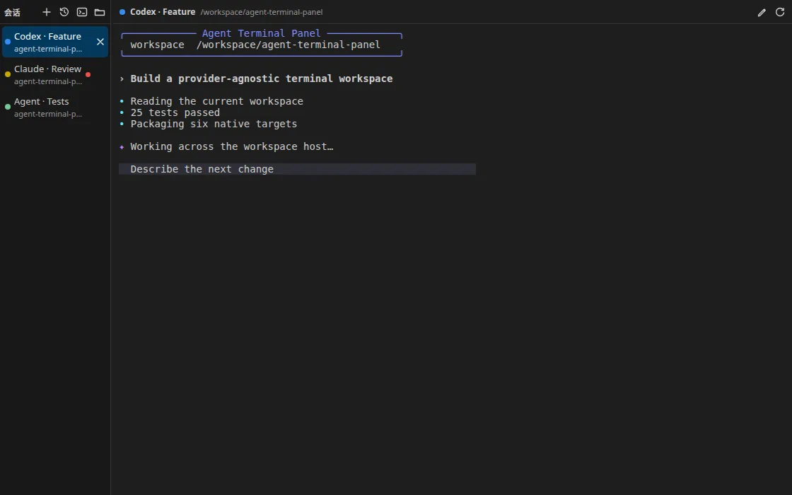
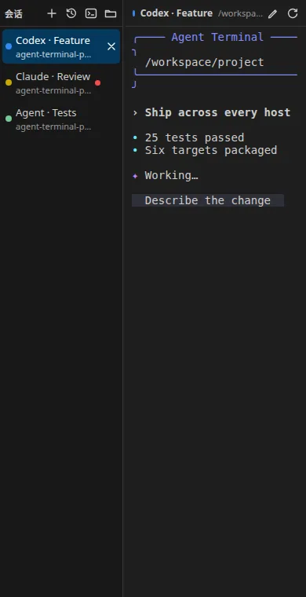

# Agent Terminal Panel

Turn almost any Agent CLI into a movable, parallel VS Code workspace that runs on the real workspace host.

[中文](./README.md) · [Marketplace](https://marketplace.visualstudio.com/items?itemName=Cx330-502.agent-terminal-panel) · [Development](./docs/DEVELOPMENT.md) · [Changelog](./CHANGELOG.md)

  

Agent Terminal Panel is provider-agnostic. You supply the launch command; it supplies a real PTY, multiple background sessions, status and attention signals, history resume/fork, and image input. Move the view between either sidebar and the bottom Panel. In WSL and Remote SSH, processes stay on the workspace extension host instead of accidentally launching on the local UI machine.

## Highlights

- **One panel for many agents**: run Codex, Claude Code, Gemini CLI, Aider, internal tools, proxy wrappers, scripts, or another interactive shell command.
- **A real terminal stack**: xterm.js + node-pty with resize, bracketed paste, CJK IME, true color, OSC 10/11/12, and correct rendering of the Codex shaded composer.
- **Parallel sessions**: create, switch, rename, close, and restart. PTYs continue in the background and recent output is replayed when the Webview is rebuilt.
- **Per-session context**: choose a cwd or launch a named one-off custom command without changing the default.
- **Continue old work**: discover only Codex and Claude Code sessions belonging to the current workspace, then invoke each provider's native resume or fork command.
- **Useful attention signals**: running, waiting for input, awaiting approval, and completed states, plus unread dots, a View badge, native toasts, and deduplicated completion sound.
- **Visible startup diagnostics**: distinguish PTY creation from waiting for the Agent's first output. Open `Output > Agent Terminal Panel` for Webview, spawn, and first-byte timings.
- **Practical image input**: paste clipboard images or drop files and supported local/remote URI transfers. The extension stores the image and inserts a safely quoted path without submitting it.
- **Native VS Code appearance**: terminal font, size, weight, line height, cursor, scroll behavior, and colors all come from VS Code's integrated terminal settings and theme.
- **Optional terminal images**: enable Sixel/iTerm support for Codex Pets and similar tools only when needed.

  

## Quick start

1. Install from the Marketplace and open the Agent Terminal icon in the Activity Bar.
2. Press `+`. On first use, enter a complete command available on the workspace host.
3. Examples include `codex`, `claude`, `gemini --model ...`, a `cc-switch-cli` wrapper, or a script with arguments and environment prefixes.
4. Use the terminal icon for a named one-off custom command.
5. Use the folder icon to choose a cwd, or the history icon to resume/fork a session from the current workspace.

There is no hidden Codex default. Commands run through the workspace host's system shell and the latest configuration is read for every new or restarted session.

## Sessions and layout

- Rename by double-clicking a session or active title, clicking the pencil, or pressing `F2`.
- Drag the session-list edge to resize it; the focused separator also supports arrow keys.
- Put the session list on the left or right with `agentTerminalPanel.sessionListPosition`.
- Move the entire view through VS Code's **Move View** action or by dragging the view title.
- The settings button opens the complete extension settings page.

Shortcuts apply only while the Agent Terminal view is focused:

| Action | Windows / Linux | macOS |
| --- | --- | --- |
| New session | `Ctrl+Shift+\`` | `Cmd+Shift+\`` |
| Next session | `Ctrl+PageDown` | `Cmd+Alt+Right` |
| Previous session | `Ctrl+PageUp` | `Cmd+Alt+Left` |
| Close session | `Ctrl+W` | `Cmd+W` |

## Image paste and drop

- Paste a clipboard image into the focused terminal, or drop up to eight images from the OS file manager.
- The per-file limit is 25 MB and the per-operation limit is 50 MB. Paths are inserted without an automatic Enter.
- Images live in VS Code extension storage, so the project directory remains clean.
- In WSL and Remote SSH, images are stored on the remote workspace host where the Agent can access them.
- VS Code core disables Webview iframe pointer events during some internal Explorer drags (see [microsoft/vscode#182449](https://github.com/microsoft/vscode/issues/182449)). If that drag never reaches the extension, copy the image in Explorer and paste it into the terminal. OS file-manager drops are not affected.

## Settings

| Setting | Default | Purpose |
| --- | --- | --- |
| `agentTerminalPanel.launchCommand` | empty | Complete command executed by the workspace-host system shell |
| `agentTerminalPanel.environment` | `{}` | Environment variables added to Agent sessions |
| `agentTerminalPanel.sessionListPosition` | `left` | Place the session list left or right of the terminal |
| `agentTerminalPanel.startSessionOnOpen` | `true` | Create a session when the view first opens |
| `agentTerminalPanel.terminalImages.enabled` | `false` | Enable Sixel/iTerm images and the Codex Pets compatibility environment |
| `agentTerminalPanel.sessionHistory.maxResults` | `100` | Maximum current-workspace history results |
| `agentTerminalPanel.sessionHistory.codexCommand` | `codex` | Codex resume/fork command prefix |
| `agentTerminalPanel.sessionHistory.claudeCommand` | `claude` | Claude Code resume/fork command prefix |
| `agentTerminalPanel.notifications.showToast` | `true` | Background approval, input, and completion toasts |
| `agentTerminalPanel.notifications.completionSound` | `whenHidden` | `never`, `whenHidden`, or `always` |

For Codex Pets, enable `agentTerminalPanel.terminalImages.enabled` and create or restart the session. The extension loads the xterm.js image addon, sets `TERM=xterm-sixel`, and removes terminal identity overrides that can hide image capabilities. The compatibility path was verified in [openai/codex#27335](https://github.com/openai/codex/issues/27335).

## Platforms and remote development

The Marketplace selects the package for the current extension host. `releases/v0.5.0/` also contains native packages for:

- Windows x64 and ARM64
- Linux x64 and ARM64, including WSL and Remote SSH workspace hosts
- Intel macOS and Apple Silicon

Each VSIX carries only the matching `node-pty` prebuild. The extension declares `extensionKind: ["workspace"]`, so install it into the remote environment when using a remote window.

## Privacy

The extension has no cloud service and does not upload terminal output, history, or images. Any network traffic, account routing, or proxy behavior belongs to the Agent command and environment you configure. History discovery reads provider records on the workspace host and filters them by the current workspace cwd.

## Project

- Author: [Cx330-502](https://github.com/Cx330-502)
- Source and issues: [Cx330-502/agent-terminal-panel](https://github.com/Cx330-502/agent-terminal-panel)
- Roadmap: [TODO.md](./TODO.md)
- License: MIT
